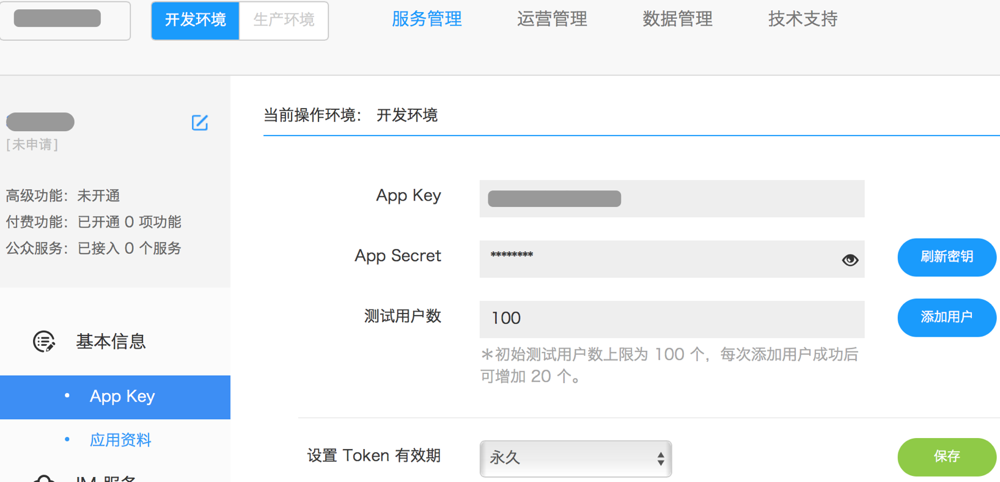
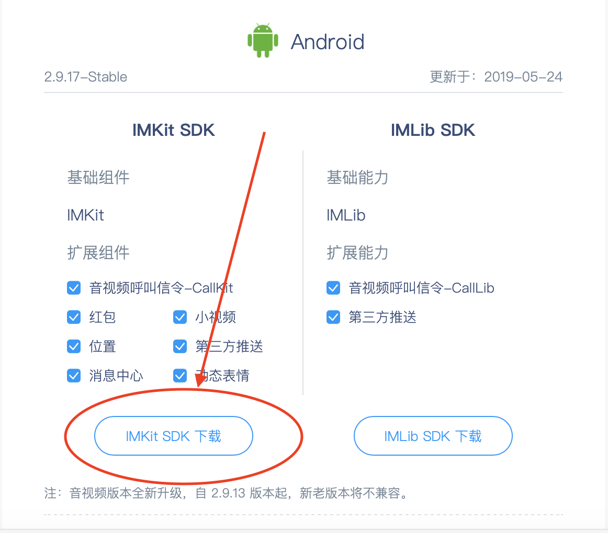
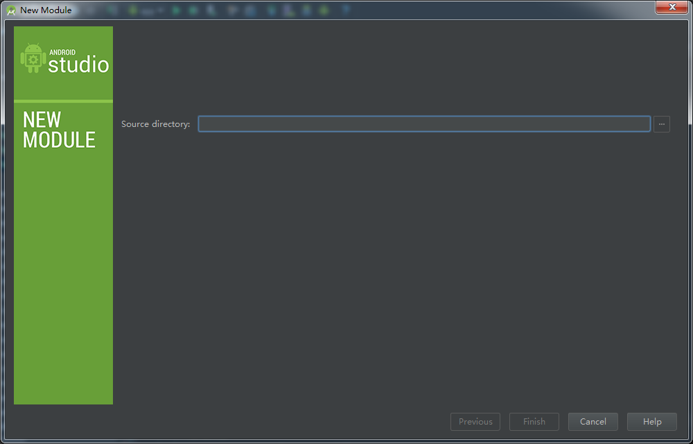
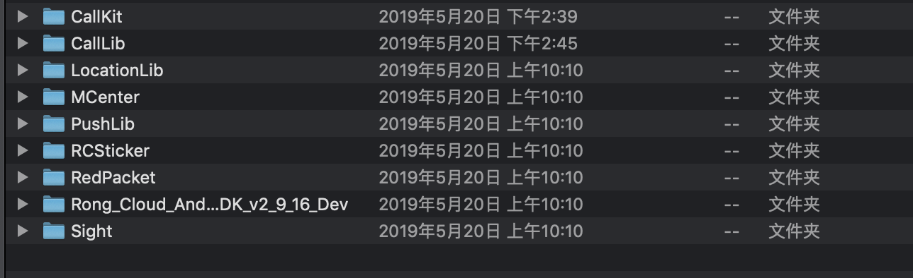
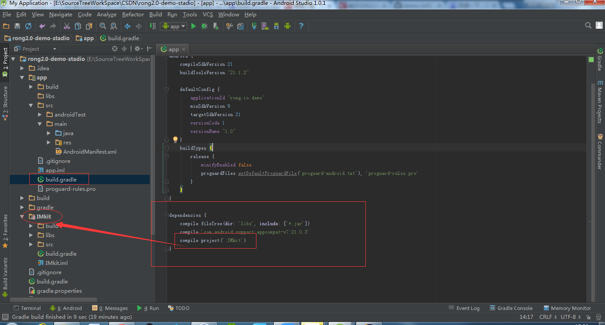

# Android IMKit 集成指南

## 创建应用

Duration: 2:00

 前往[融云开发者后台](https://developer.rongcloud.cn/signin)注册融云开发者帐号。


negative
: **备注**
      1 .  App Key / Secret ：相当于您的  App  在融云的帐号和密码。是 SDK 连接服务器所必需的标识，每一个  App  对应一套  App Key / Secret。
      2 .  Token 有效期 ：建议设为永久保存；一个用户可以生成多个 Token，每个 Token 都是可用的。
      3 .  开发环境与生产环境的切换，对应的 Token 都是不一样的。
      App Key / Secret 与  Token 会在初始化配置中用到  

## 导入 SDK

Duration: 5:00

### 环境要求

| 名称                    | 版本                         |
| ----------------------- | ---------------------------- |
| Android SDK Build-tools | 21 及以上                    |
| JAVA                    | JDK 1.7 及以上               |
| Android Support V4      | Android Support V4 21 及以上 |
| Android SDK             | Android API 15               |

### 导入 SDK

SDK 支持以下俩种方式导入，您可以任选其一：

#### 导入 maven 方式

1.在工程 build.gradle 配置脚本中 allprojects 段中添加 im_sdk 新 maven 仓库地址：

```java
    allprojects {
        repositories {
            jcenter()
            mavenCentral()
            maven {url  "https://dl.bintray.com/rongcloud/maven"}
        }
    }
```

2.在项目的 build.gradle 添加远程依赖：

```java
api 'cn.rongcloud.sdk:im_kit:2.9.17'
//im_kit必须依赖im_lib，所以需要加入对应依赖
api 'cn.rongcloud.sdk:im_lib:2.9.17'
```

 negative
: **备注**
       SDK 版本是不断在迭代升级的，可以修改依赖中的版本号，使用最新版本的 SDK 。参考 [https://support.rongcloud.cn/ks/OTUx](https://support.rongcloud.cn/ks/OTUx)。

#### 导入 Module 方式

到[融云 SDK 下载 https://www.rongcloud.cn/downloads](https://www.rongcloud.cn/downloads/)下载 SDK。如图所示：



negative
: **注意**
   下载界面默认勾选您需要所有组件，根据需求自主选择。

IMKit 包含会话列表、聊天窗口、消息内容展现、会话设置等功能封装为组件。

IMLib 是不含界面的基础 IM 通讯能力库，封装了通信能力和会话、消息等对象。

SDK 各部分功能以插件化的形式独立提供。各组件的功能如下：

#### 各组件介绍

| 名称        | 功能介绍     | 备注                                                 |
| ----------- | ------------ | ---------------------------------------------------- |
| IMKit       | IM 界面组件  | ——                                                   |
| IMLib       | 基础通信库   | 支持的 CPU 架构 armeabi，armeabi-v7a，arm64-v8a，x86 |
| RCSticker   | 表情组件     | ——                                                   |
| Sight       | 小视频       | ——                                                   |
| LocationLib | 位置相关库   | ——                                                   |
| PushLib     | 第三方推送库 | 支持的 CPU 架构 armeabi, armeabi-v7a, arm64-v8a, x86 |
| RedPacket   | 红包组件     | ——                                                   |

打开工程， File -> New -> Import Module


解压 SDK，选择所需要的 SDK 。如图：
 

### 配置说明

 1 打开 App 的 build.gradle，在  dependencies 中添加相应模块的依赖。如图：



 2    打开 IMLib Module 的 AndroidManifest.xml 文件，把 meta-data RONG_CLOUD_APP_KEY 的值修改为自己的 AppKey. 如图：

```java
<meta-data
android:name="RONG_CLOUD_APP_KEY"
android:value="您的应用 AppKey" />

```

   3    在应用的 App Module 的 AndroidManifest.xml 文件中，添加 FileProvider 相关配置，修改 android:authorities 为App 的应用的 “ApplicationId”.FileProvider。

```java
    <provider
            android:name="android.support.v4.content.FileProvider"
            android:authorities="${applicationId}.FileProvider"
            android:exported="false"
            android:grantUriPermissions="true">
            <meta-data
                android:name="android.support.FILE_PROVIDER_PATHS"
                android:resource="@xml/rc_file_path" />
    </provider>
```

negative
: **注意**
   集成时必须添加 libsqlite.so 文件，参考知识库：[https://support.rongcloud.cn/kb/NTQw](https://support.rongcloud.cn/kb/NTQw)


## 初始化

Duration: 2:00

在整个应用程序中，只需要调用一次 init 方法。

`示例代码`

```java
public class App extends Application {
        @Override
        public void onCreate() {
            super.onCreate();
            RongIM.init(this);
        }
    }


```

**关于初始化的注意事项**

SDK 使用了跨进程机制来进行通信，运行后，会发现以下三个进程： 

1、`APP 的应用主进程 `  :  App 包名；

2、`APP 的应用包名:ipc ` : 通信进程；

3、`io.rong.push` : 推送进程，集成的是融云第三方推送，则不会存在此推送进程。


##  连接服务

Duration: 4:00

negative
: **说明**
    1 connect 方法在应用的生命周期里只需要调用一次，且必须在主进程调用。
    2 连接失败，SDK 会自动启动重连机制，无需进行重连操作。
    应用的生命周期：应用场长时间后台之后，应用被回收，此时属于新的进程，也需要调用 connect 方法。
    自动重连机制：进行最多 10 次重连，分别是 1、2、4、8、16、32、64、128、256、512 秒后。若没有连接成功，还会在检测网络状态变化时再次重连。

​     

` connect 参数说明:`

| 参数                           | 类型   | 说明                                                  |
| :----------------------------- | :----- | :---------------------------------------------------- |
| Token                          | String | Token 即用户令牌，是 App 上当前用户连接融云的身份凭证 |
| RongIMClient.ConnectCallback() | Object | callback                                              |


`回调方法说明:`

| 回调方法名       | 说明                                                         |
| :--------------- | :----------------------------------------------------------- |
| onTokenIncorrect | Token 错误，请参考[ Token 错误](https://support.rongcloud.cn/ks/NjQ4) |
| onSuccess        | 连接成功,可进行页面跳转                                      |
| onError          | 连接失败,[业务错误码](https://docs.rongcloud.cn/im/server/status_code/)，非业务错误码，可进行页面跳转 |


`示例代码:`

```java
RongIM.connect("用户Token", new RongIMClient.ConnectCallback() {
        @Override
        public void onTokenIncorrect() {

        }
        @Override
        public void onSuccess(String userid) {
            Log.d("TAG", "--onSuccess" + userid);

        }
        @Override
        public void onError(RongIMClient.ErrorCode errorCode) {
            Log.d("TAG", "--onSuccess" + errorCode);
        }
    });
```

negative
: **注意**
    当应用被杀死后，接受到推送通知，点击通知拉起应用时，此时应用被重新唤起，属于新的生命周期，需要再次调用 connect 方法进行连接。

​     

##  会话列表

Duration: 5:00

#### 静态方式加载

  配置布局文件:  Activity 对应的布局文件： conversationlist.xml。

```java
    <?xml version="1.0" encoding="utf-8"?>
    <LinearLayout xmlns:android="http://schemas.android.com/apk/res/android"
        android:orientation="vertical" android:layout_width="match_parent"
        android:layout_height="match_parent">
        <fragment
            android:id="@+id/conversationlist"
            android:name="io.rong.imkit.fragment.ConversationListFragment"
            android:layout_width="match_parent"
            android:layout_height="match_parent" />
    </LinearLayout>
```

#### 动态方式加载

```java
    ConversationListFragment mConversationListFragment=new ConversationListFragment()；
    Uri uri = Uri.parse("rong://" + getApplicationInfo().packageName).buildUpon()
            .appendPath("conversationlist")
            .appendQueryParameter(Conversation.ConversationType.PRIVATE.getName(), "false") 
            .appendQueryParameter(Conversation.ConversationType.GROUP.getName(), "false")
            .appendQueryParameter(Conversation.ConversationType.PUBLIC_SERVICE.getName(), "false")
            .appendQueryParameter(Conversation.ConversationType.APP_PUBLIC_SERVICE.getName(), "false")
            .appendQueryParameter(Conversation.ConversationType.SYSTEM.getName(), "true")
            .build();
    mConversationListFragment.setUri(uri);
    FragmentManager manager = getSupportFragmentManager();
    FragmentTransaction transaction = manager.beginTransaction();
    transaction.replace(R.id.relativeLayout_main, mConversationListFragment);
    transaction.commit(); 
```

配置 intent-filter：

SDK 是通过隐式调用的方式来实现界面跳转的。因此需要在 AndroidManifest.xml 中，会话列表 Activity 下面配置 intent-filter，需要手动修改 android:host 是 App 的 ApplicationId。

```java
<activity
    android:name="io.rong.fast.activity.ConversationListActivity"
    android:screenOrientation="portrait"
    android:windowSoftInputMode="stateHidden|adjustResize">
<intent-filter>
    <action android:name="android.intent.action.VIEW" />

    <category android:name="android.intent.category.DEFAULT" />

    <data
        android:host="${applicationId}"
        android:pathPrefix="/conversationlist"
        android:scheme="rong" />
</intent-filter>
</activity>
```

#### 会话列表

`会话列表参数说明:`

| 参数                  | 类型                 | 说明                                                         |
| :-------------------- | :------------------- | :----------------------------------------------------------- |
| context               | Context              | 上下文                                                       |
| supportedConversation | Map<String, Boolean> | 定义会话列表支持显示的会话类型，及对应的会话类型是否聚合显示。 |

`示例代码:`

```java
/**
 * 启动会话列表界面。
 */
RongIM.getInstance().startConversationList(Context , supportedConversation)
```

## 

##  会话界面

Duration: 5:00

#### 静态方式加载

配置布局文件:  Activity 对应的布局文件 conversation.xml。

```java
<?xml version="1.0" encoding="utf-8"?>
<LinearLayout xmlns:android="http://schemas.android.com/apk/res/android"
android:layout_width="match_parent"
android:layout_height="match_parent"
android:orientation="vertical">
<fragment
android:id="@+id/conversation"
android:name="io.rong.imkit.fragment.ConversationFragment"
android:layout_width="match_parent"
android:layout_height="match_parent" />
</LinearLayout>


```

#### 动态方式加载

```java
    ConversationFragment mConversationFragment=new ConversationFragment();
    Uri uri = Uri.parse("rong://" + getApplicationInfo().packageName).buildUpon()
            .appendPath("conversation").appendPath(mConversationType.getName().toLowerCase())
            .appendQueryParameter("targetId", mTargetId).build();
    mConversationFragment.setUri(uri);
    FragmentManager manager = getSupportFragmentManager();
    FragmentTransaction transaction = manager.beginTransaction();
    transaction.replace(R.id.relativeLayout_main,mConversationFragment );
    transaction.commit(); // 提交创建Fragment请求
```


配置 intent-filter

在 AndroidManifest.xml 中，会话 Activity 下面配置 intent-filter。 注意请修改 android:host 为  App 的 ApplicationId，其他保持不变。

```java
 <activity
     android:name="io.rong.fast.activity.ConversationActivity"
     android:screenOrientation="portrait"
     android:windowSoftInputMode="stateHidden|adjustResize">
 <intent-filter>
     <action android:name="android.intent.action.VIEW" />

     <category android:name="android.intent.category.DEFAULT" />

     <data
         android:host="${applicationId}"
         android:pathPrefix="/conversation/"
         android:scheme="rong" />
 </intent-filter>
  </activity>
```

#### 启动会话界面

在点击会话列表或点击通讯录联系人之后，启动会话界面。

`会话界面参数说明:`

| 参数             | 类型                          | 说明                                                         |
| :--------------- | :---------------------------- | :----------------------------------------------------------- |
| context          | Context                       | 上下文                                                       |
| conversationType | Conversation.ConversationType | 会话类型                                                     |
| targetId         | String                        | 根据不同的 conversationType，可能是用户 Id、群组 Id 或聊天室 Id |
| title            | String                        | 聊天的标题                                                   |

`示例代码:`

```java
/**
 * 启动会话界面。
 */
RongIM.getInstance().startConversation(mContext, Conversation.ConversationType.PRIVATE , targetId, title)
```

## 

## 广播接收器

Duration: 3:00

​      当应用处于后台运行或者和融云服务器 disconnect() 的时候，收到消息，融云 SDK 会以通知形式提醒您。所以需要自定义一个继承融云 PushMessageReceiver 的广播接收器，用来接收提醒通知。


`广播接收器方法说明:`

| 方法名                       | 说明           |
| :--------------------------- | :------------- |
| onNotificationMessageArrived | 监听消息的到达 |
| onNotificationMessageClicked | 点击通知栏     |

`示例代码:`

```java
public class SealNotificationReceiver extends PushMessageReceiver {
    @Override
    public boolean onNotificationMessageArrived(Context context, PushNotificationMessage message) {
        return false; // 返回 false, 会弹出 SDK 默认通知; 返回 true,  SDK 不会弹通知, 通知需要由您自定义。
    }
    @Override
    public boolean onNotificationMessageClicked(Context context, PushNotificationMessage message) {
        return false; // 返回 false, 会走 SDK 默认处理逻辑, 即点击该通知会打开会话列表或会话界面; 返回 true, 则由您自定义处理。
    }
}
```

具体可[推送参考文档](https://docs.rongcloud.cn/im/push/android/summary/)。

negative
: **注意**
    除华为透传通知外， APP 集成的是第三方的推送，则接收到推送的时候不会执行该方法。

## 断开连接

Duration: 2:00

 提供以下两种断开连接的方法：

1 想在断开连接后，有新消息时，仍然能够收到推送通知，调用 disconnect() 方法。

`示例代码:`

```java

 RongIM.getInstance().disconnect()
```

2 断开连接后，不想收到任何推送通知，调用 logout() 方法。

`示例代码:`

```java

  RongIM.getInstance().logout()
```

## 打包混淆

Duration: 3:00

```java
-keepattributes Exceptions,InnerClasses

-keepattributes Signature

 //RongCloud SDK
-keep class io.rong.** {*;}
-keep class cn.rongcloud.** {*;}
-keep class * implements io.rong.imlib.model.MessageContent {*;}
-dontwarn io.rong.push.**
-dontnote com.xiaomi.**
-dontnote com.google.android.gms.gcm.**
-dontnote io.rong.**

 //VoIP
-keep class io.agora.rtc.** {*;}

//红包
-keep class com.google.gson.** { *; }
-keep class com.uuhelper.Application.** {*;}
-keep class net.sourceforge.zbar.** { *; }
-keep class com.google.android.gms.** { *; }
-keep class com.alipay.** {*;}
-keep class com.jrmf360.rylib.** {*;}

-ignorewarnings
```

另外，需要 keep 自定义的 BroadcastReceiver 。使用下面的代码 keep 自定义的 BroadcastReceiver。

这里 io.rong.app.DemoNotificationReceiver 改成APP的应用自定义的完整类名

-keep class io.rong.app.DemoNotificationReceiver {*;}

negative
: **注意**
  如果是需要特殊的混淆，比如高德地图的混淆，请参考[高德 SDK 混淆](https://lbs.amap.com/api/android-location-sdk/guide/create-project/dev-attention/?sug_index=0)提供的混淆方式。


