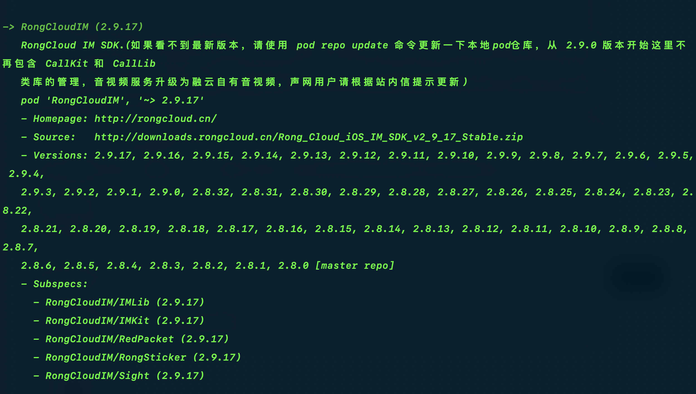
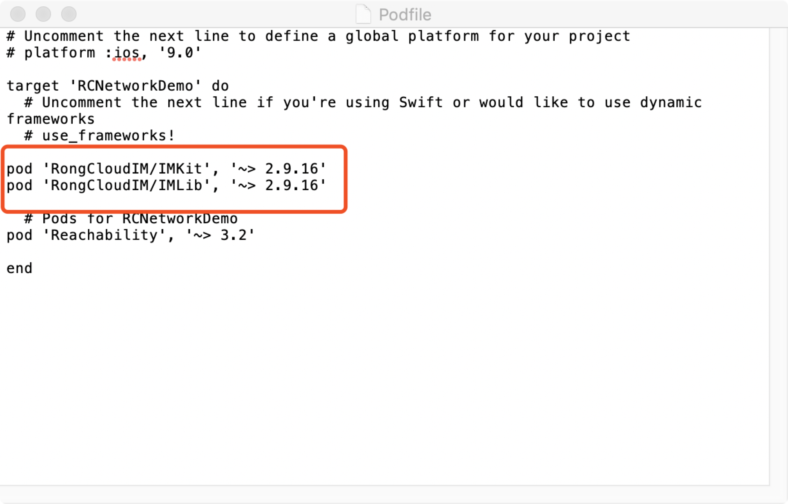

# iOS IMKit 集成指南

## 导入SDK

Duration: 5:00

#### 环境安装

CocoaPods [安装](https://cocoapods.org/)

#### 集成SDK

1、执行 **`pod search RongCloudIM`**



[IM CocoaPods 功能模块详细介绍](http://support.rongcloud.cn/kb/NTQ2)

2、 **`cd`** 到 工程目录

3、 执行 **`pod init`**

4、 执行 **`open -e Podfile`**

5、 添加 **pod** 内容



6、 执行 **`pod install`**

7、 双击 **`.xcworkspace`** 文件

## 初始化

Duration: 3:00

#### 引入
使用 SDK 功能前，请 `import` 下面的头文件，`Swift` 项目需要在工程的 `Bridging-Header.h` 文件中添加 SDK 的引用

```objectivec
#import <RongIMKit/RongIMKit.h>
```


#### 初始化

1、 请使用开发功能之前从[融云开发者控制台](https://developer.rongcloud.cn/app/appkey/iwj1eg7Wb9M437VP1w==)注册得到的 `Appkey`，通过 `RCIM` 的单例，传入 `initWithAppKey:` 方法，初始化 SDK。
2、 开发者在使用融云 SDK 所有功能之前，开发者必须先调用此方法初始化 SDK。 在 App 的整个生命周期中，开发者只需要将 SDK 初始化一次。

```objective-c

- (BOOL)application:(UIApplication *)application didFinishLaunchingWithOptions:(NSDictionary *)launchOptions {
    // Override point for customization after application launch.

    //初始化AppKey
    [[RCIM sharedRCIM] initWithAppKey:@"获取到的AppKey"];

    //...其他操作
    return YES;
}

```

## 连接融云

Duration: 5:00

将通过 `Server` 获取到的 `Token`，通过 `RCIM` 的单例，调用下面的方法，即可建立与服务器的连接。


在 App 整个生命周期，开发者只需要调用一次此方法与融云服务器建立连接。之后无论是网络出现异常或者 App 有前后台的切换等，SDK 都会负责自动重连。除非已经手动将连接断开，否则不需要自己再手动重连。

```objectivec

[[RCIM sharedRCIM] connectWithToken:@"获取到的Token" 
	success:^(NSString *userId) {
    
    	    //连接建立成功的回调
	    NSLog(@"登录成功; userid :%@",userId);
	    //此方法的回调并非为原调用线程，您如果需要进行 UI 操作，请注意切换到主线程。
	    dispatch_async(dispatch_get_main_queue(), ^{

	        //UI操作

	    });
    
	} error:^(RCConnectErrorCode status) {

		//连接建立失败的回调

	} tokenIncorrect:^{

		//token 错误或者过期的回调

}];
```

**`tokenIncorrectBlock` 有两种情况：**

1、  `token` 错误

请您检查客户端初始化使用的 `AppKey` 和您服务器获取 `token` 用的 AppKey 是否一致；

2、  `token` 过期

是因为开发者后台设置了 `token` 过期时间，需要请求服务器重新获取 `token` 并再次用新的 `token` 建立连接。


在 `tokenIncorrectBlock` 的情况下，您需要请求您的服务器重新获取 `token` 并建立连接，但是注意避免无限循环，以免影响 `App` 用户体验。


<!-- 关于 `RCConnectErrorCode`，开发者仅需关注以下几种连接错误码，其余错误码 SDK 均会进行自动重连，开发者无须处理。


| 错误码 | 参数                           | 原因                                                         |
| ------ | ------------------------------ | ------------------------------------------------------------ |
| 31002  | RC_CONN_ID_REJECT              | App Key 错误，请检查使用的 App Key 是否正确。                |
| 31004  | RC_CONN_TOKEN_INCORRECT        | Token 无效，参考上诉文档 tokenIncorrectBlock 的两种错误情况。 |
| 31007  | RC_CONN_PACKAGE_NAME_INVALID   | 检查 App 的 BundleID 是否正确。                              |
| 31008  | RC_CONN_APP_BLOCKED_OR_DELETED | App Key 被封禁或已删除，检查使用的 App Key 是否正确。        |
| 31009  | RC_CONN_USER_BLOCKED           | 用户被封禁，检查使用的 Token 是否正确，以及对应的 UserId 是否被封禁。 |
| 31010  | RC_DISCONN_KICK                | 当前用户在其他设备上登录，此设备被踢下线                     |
| 33001  | RC_CLIENT_NOT_INIT             | SDK 没有初始化，在使用 SDK 任何功能之前，必须先 [Init]()。     |
| 33003  | RC_INVALID_PARAMETER           | 检查接口调用时传入的参数类型和值。                           |
| -1000  | RC_INVALID_ARGUMENT            | 检查接口调用时传入的参数类型和值。                           |
 -->


## 新建会话列表

Duration: 3:00

新建一个继承于 `RCConversationListViewController` 的控制器, 初始化控制器对象并设置需要显示的会话类型和需要聚合显示的会话类型

代码示例:

```objectivec

RCCustomConversationListViewController *customVC = [[RCCustomConversationListViewController alloc] init];
//设置在列表中需要显示的会话类型
customVC.displayConversationTypeArray = @[@(ConversationType_PRIVATE),@(ConversationType_GROUP),@(ConversationType_SYSTEM)];
//设置在列表中需要聚合为一条显示的会话类型
customVC.collectionConversationTypeArray = @[@(ConversationType_SYSTEM)];
[self.navigationController pushViewController:customVC animated:YES];

```
## 跳转会话页面

Duration: 3:00

在继承 `RCConversationListViewController` 的会话列表中加入以下代码，即可点击进入聊天会话界面。

必须在 `push` 之前传入 `conversationType` 和 `targetId`。

```objectivec
//重写RCConversationListViewController的onSelectedTableRow事件

- (void)onSelectedTableRow:(RCConversationModelType)conversationModelType
         conversationModel:(RCConversationModel *)model
               atIndexPath:(NSIndexPath *)indexPath {

    RCConversationViewController *conversationVC = [[RCConversationViewController alloc] init];
    //会话类型
    conversationVC.conversationType = model.conversationType;
    //会话ID
    conversationVC.targetId = model.targetId;
    //会话标题
    conversationVC.title = @"想显示的会话标题";
    [self.navigationController pushViewController:conversationVC animated:YES];
}
```


## 断开连接

Duration: 3:00

在断开与融云服务器的连接时，SDK 可设置是否接收 `push`。

因为 SDK 在前后台切换或者网络出现异常都会自动重连，会保证连接的可靠性。所以除非 App 逻辑需要登出，否则不需要调用此方法进行手动断开。

代码示例:
```objectivec
//断开连接，但仍然接收push( 2 选 1 即可)
[[RCIM sharedRCIM] disconnect:YES];

[[RCIM sharedRCIM] disconnect];
```
```objectivec
//断开连接，并不再接收push( 2 选 1 即可)
[[RCIM sharedRCIM] disconnect:NO];

[[RCIM sharedRCIM] logout];
```

## 参考

如需了解更多 `IMKit` 集成相关知识，请访问[融云开发文档](https://docs.rongcloud.cn/im/imkit/ios/quick-start/import/)。


