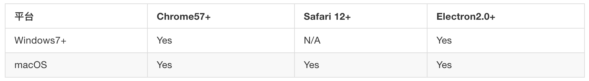

# Web CallLib 集成示例

## 前期准备

Duration: 5:00

SealRTC Web 是基于 [RongCloud Web CallLib](https://www.rongcloud.cn/docs/web_rtclib.html) 的音视频示例，通过此示例，可更好的帮助您集成、使用 Web CallLib SDK

#### 创建应用

1、移步融云开发者后台: [https://developer.rongcloud.cn](https://developer.rongcloud.cn)

2、输入必要信息注册用户


3、首次登录融云开发者后台


4、创建应用

#### 开通服务


## CallLib Demo Server

Duration: 5:00

**Demo Server 作用**

1、为 CallLib Web Demo 提供获取 token 的接口

2、自动创建群组, 提供进行群组音视频的能力

<b>注</b>: 运行 Web Demo 时, 必须运行 Demo Server, 并且 appKey 配置必须一致

**下载并安装 Node.js**

Node.js 最低版本为 [10+](http://nodejs.cn/download/)，如果机器已安装 Node ，可使用 [NVM](https://github.com/creationix/nvm) 切换版本

**快速启动**

1、下载 Demo Server 源码

[https://github.com/rongcloud/websdk-demo/tree/master/calllib-v3/server](https://github.com/rongcloud/websdk-demo/tree/master/calllib-v3/server)

2、进入 server 根目录执行

```bash
npm install
```

3、修改配置文件 `setting.js`

```js
module.exports = {
  appkey: 'appkey', // 融云应用 AppKey，可在融云开发者后台获取
  secret: 'secret', // 融云应用 Secret，可在融云开发者后台获取
  port: '9929' // 启动服务端口号, 默认 9929, 按需修改
};
```

4、启动服务

```
npm run serve
```

启动成功后, 控制台输出如下:


<b>注</b>: 此 Server 仅供测试, 生产环境 App Server 需部署 https 协议

## CallLib Demo Web

Duration: 5:00

1、下载 Demo Web 源码

[https://github.com/rongcloud/websdk-demo/tree/master/calllib-v3/web](https://github.com/rongcloud/websdk-demo/tree/master/calllib-v3/web)

2、修改配置文件 `setting.js`

```js
{
  appkey: 'appkey', // 融云应用 AppKey，可在融云开发者后台获取
  server: 'http://localhost:9929' // Demo Server 地址
}
```

3、启动 `index.html` 开始体验

<b>注</b>: 浏览器限制协议必须是 `HTTPS` 或 `http://localhost:port` 才可使用摄像头、麦克风

所以需准备本地服务，若无本地服务，推荐: [Nginx](http://nginx.org/en/download.html) 或 [Node.js Puer](https://www.npmjs.com/package/puer)

<br><br><br>

使用 Puer 启动服务器示例:

1、全局安装 puer

```bash
npm install puer -g
```

2、打开命令行 `Web Demo` 根目录

```bash
puer --port 3582
```

启动成功后出现如下界面，点击 `index.html` 开始体验


## 演示示例

Duration: 5:00

#### CallLib Demo Web 浏览器兼容性说明



1、在谷歌浏览器使用两个 Tab 页面分别打开 Web Demo: [http://localhost:3582/src/index.html](http://localhost:3582/src/index.html)


2、两个页面分别输入不同的用户 id(例如用户为 A、B), 点击登录, 进入通话界面


3、用户 A 点击视频或音频按钮, 输入用户 B 的 id


4、用户 B 接收到 A 发送的音视频请求, 点击接听按钮


5、开始音视频通话


## 相关文档

Duration: 1:00

Web CallLib 开发指南: [https://docs.rongcloud.cn/rtc/calllib/web/summary/](https://docs.rongcloud.cn/rtc/calllib/web/summary/)

Web IM SDK 开发指南: [https://docs.rongcloud.cn/im/imlib/web/summary/](https://docs.rongcloud.cn/im/imlib/web/summary/)

融云知识库: [https://support.rongcloud.cn](https://support.rongcloud.cn)

融云开发者后台: [https://developer.rongcloud.cn](https://developer.rongcloud.cn)
