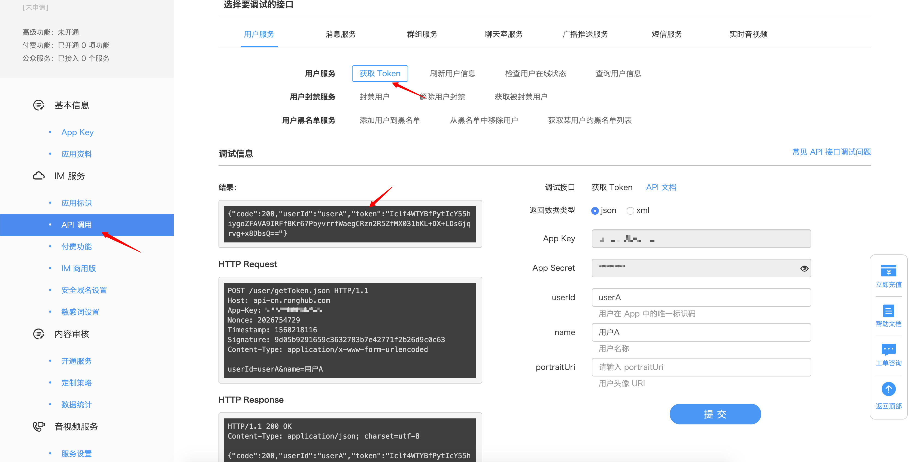
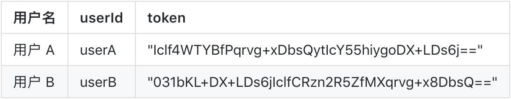
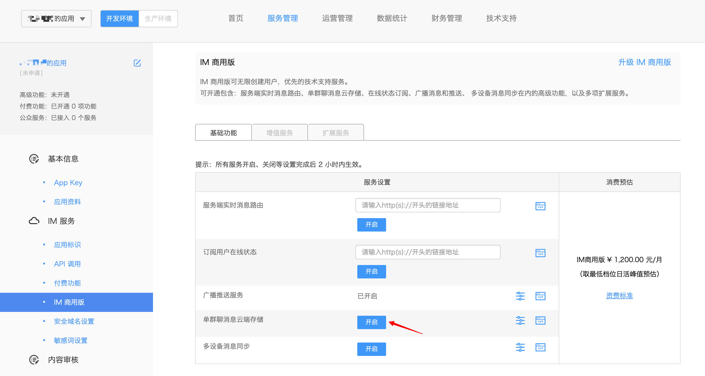

# Web IMLib 集成指南

## 前期准备

Duration: 3:00

引入真实开发环境，帮助开发者快速上手使用 Web IM SDK 部分 API 

#### 创建应用

移步融云开发者后台: [https://developer.rongcloud.cn](https://developer.rongcloud.cn)

#### 获取 token

1、[开发者后台](https://developer.rongcloud.cn) 获取



2、使用 Server API

Server API 文档: [https://www.rongcloud.cn/docs/server_sdk_api/index.html](https://www.rongcloud.cn/docs/server_sdk_api/index.html)

用户模块: User.register

**注** ：Server API 需 Server 端封装后，web 端再去调用

3、由开发者后台，获取如下相关信息。（**注**：此为模拟数据，实际使用需由开发者获取）



## Web IM SDK 集成

Duration: 3:00

### 1、引入 SDK

```js
/* HTTP */
<script src="http://cdn.ronghub.com/RongIMLib-2.4.0.js"></script>
/* HTTPS */‘
<script src="https://cdn.ronghub.com/RongIMLib-2.4.0.js"></script>
/* 压缩版 */
<script src="https://cdn.ronghub.com/RongIMLib-2.4.0.min.js"></script>
```

### 2、初始化

```js
RongIMLib.RongIMClient.init('appkey'); //开发者后台 -> 基本信息 获取
```

### 3、设置监听

**注**: 需先设置监听再连接服务器

```js
/* 连接状态监听器 */ 
RongIMClient.setConnectionStatusListener({
  onChanged: function (status) {
    /* status 标识当前连接状态 */ 
    switch (status) {
      case RongIMLib.ConnectionStatus.CONNECTED:
        console.log('链接成功');
        break;
      case RongIMLib.ConnectionStatus.CONNECTING:
        console.log('正在链接');
        break;
      case RongIMLib.ConnectionStatus.DISCONNECTED:
        console.log('断开连接');
        break;
      case RongIMLib.ConnectionStatus.KICKED_OFFLINE_BY_OTHER_CLIENT:
        console.log('其他设备登录');
        break;
      case RongIMLib.ConnectionStatus.DOMAIN_INCORRECT:
        console.log('域名不正确');
        break;
      case RongIMLib.ConnectionStatus.NETWORK_UNAVAILABLE:
        console.log('网络不可用');
        break;
    }
  }
});
/* 消息监听器 */
RongIMClient.setOnReceiveMessageListener({
  onReceived: function (message) {
    console.log(message);
  }
});
```

### 4、连接服务器

```js
/* 开发者后台获取或 Server API */
var token = 'token'; 
RongIMClient.connect(token, {
  onSuccess: function(userId) {
    console.log('Connect successfully. ' + userId);
  },
  onTokenIncorrect: function() {
    console.log('token 无效');
  },
  onError: function(errorCode){
    var info = '';
    switch (errorCode) {
      case RongIMLib.ErrorCode.TIMEOUT:
        info = '超时';
        break;
      case RongIMLib.ConnectionState.UNACCEPTABLE_PAROTOCOL_VERSION:
        info = '不可接受的协议版本';
        break;
      case RongIMLib.ConnectionState.IDENTIFIER_REJECTED:
        info = 'appkey不正确';
        break;
      case RongIMLib.ConnectionState.SERVER_UNAVAILABLE:
        info = '服务器不可用';
        break;
    }
    console.log(info);
  }
});
```

## 发送消息

Duration: 3:00

向用户 B 发送一条文本消息，发送成功会走 onSuccess 回掉函数，发送失败会走 onError 失败回掉，用户可根据 errorCode 进行异常信息调试。

```js
var msg = new RongIMLib.TextMessage({ content: 'hello RongCloud!', extra: '附加信息' });
var conversationType = RongIMLib.ConversationType.PRIVATE; // 单聊
var targetId = 'userB'; // 用户 B 的 userId 
RongIMClient.getInstance().sendMessage(conversationType, targetId, msg, {
    onSuccess: function (message) {
        // message 为发送的消息对象并且包含服务器返回的消息唯一 Id 和发送消息时间戳
        console.log('Send successfully');
    },
    onError: function (errorCode, message) {
        console.log(errorCode)
    }
});

```

## 接收消息

Duration: 2:00

用户 B 连接服务器成功后，可通过消息监听函数 RongIMClient.setOnReceiveMessageListener 接收用户 A 发送的消息,收到消息会自动触发 onReceived 回掉函数。

```js
/* 消息监听器 */
RongIMClient.setOnReceiveMessageListener({
  onReceived: function (message) {
    console.log(message);
  }
});
```
**注**：上述代码需在 SDK 集成时使用

## 获取历史消息

Duration: 2:00

###开通服务
该功能需在 [开发者后台](https://developer.rongcloud.cn) 开启 单聊消息云存储 功能，开通位置：开发者后台 -> 服务管理 -> IM 商用版



###消息获取
用户 B 获取与用户 A 的单聊历史消息

```js
var conversationType = RongIMLib.ConversationType.PRIVATE; //单聊, 其他会话选择相应的消息类型即可
var targetId = 'userA'; // 想获取自己和谁的历史消息，targetId 赋值为对方的 userId。类型： string
var timestrap = null; // 默认传 null，若从头开始获取历史消息，请赋值为 0, timestrap = 0;
var count = 20; // 每次获取的历史消息条数，范围 0-20 条，可以多次获取
RongIMLib.RongIMClient.getInstance().getHistoryMessages(conversationType, targetId, timestrap, count, {
    onSuccess: function(list, hasMsg) {
        // list => Message 数组。
        // hasMsg => 是否还有历史消息可以获取。
    },
    onError: function(error) {
        console.log('GetHistoryMessages, errorcode:' + error);
    }
});
```

## 获取会话列表

Duration: 3:00

1、该功能需开启 单聊消息云存储 功能，方法同获取历史消息开通服务部分

```js
RongIMClient.getInstance().getConversationList({
  onSuccess: function(list) {
      // list => 会话列表集合
  },
  onError: function(error) {
      // do something
  }
}, null);
```

## 相关文档

Duration: 1:00

Web IM SDK 开发指南: [https://docs.rongcloud.cn/im/imlib/web/summary/](https://docs.rongcloud.cn/im/imlib/web/summary/)

融云知识库: [https://support.rongcloud.cn](https://support.rongcloud.cn)

融云开发者后台: [https://developer.rongcloud.cn](https://developer.rongcloud.cn)


