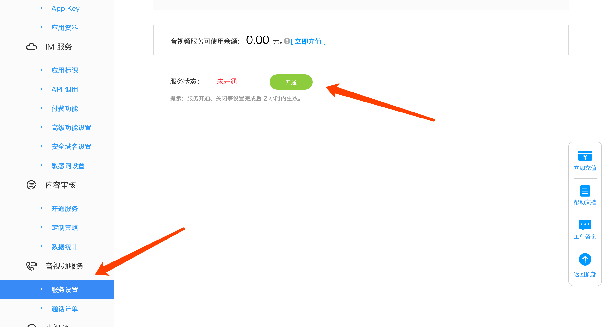
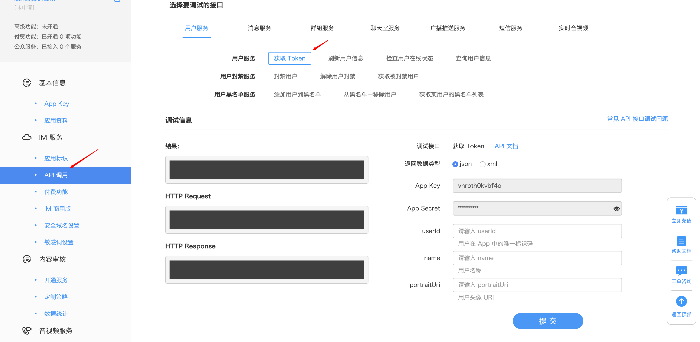
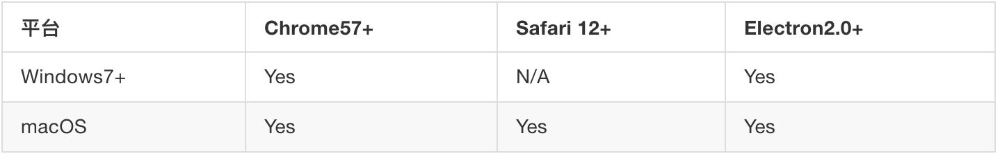

# Web RTC 3.0 集成指南

## 前期准备

Duration: 5:00

#### 创建应用

移步融云开发者后台: [https://developer.rongcloud.cn](https://developer.rongcloud.cn)

#### 开通音视频服务



#### 获取 token

1、[开发者后台](https://developer.rongcloud.cn) 获取



2、使用 Server API

Server API 文档: [https://www.rongcloud.cn/docs/server_sdk_api/index.html](https://www.rongcloud.cn/docs/server_sdk_api/index.html)

用户模块: User.register

注意：Server API 需 Server 端封装后，web 端再去调用

#### 本地服务

**浏览器限制协议必须是 `HTTPS` 或 `http://localhost:port` 方可使用摄像头、麦克风**

所以需准备本地服务，若无本地服务推荐: [Nginx](http://nginx.org/en/download.html) 或 [Node.js Puer](https://www.npmjs.com/package/puer)

以 Puer 为例启动服务器

1、全局安装 puer

```bash
npm install puer -g
```

#### RTC SDK 3.0 兼容性说明



## IM 服务连接

Duration: 5:00

1、引入 Web IM SDK

```js
/* HTTP */
<script src="http://cdn.ronghub.com/RongIMLib-2.4.0.js"></script>
/* HTTPS */‘
<script src="https://cdn.ronghub.com/RongIMLib-2.4.0.js"></script>
/* 压缩版 */
<script src="https://cdn.ronghub.com/RongIMLib-2.4.0.min.js"></script>
```

2、初始化

```js
/* 可在融云开发者后台获取 */
RongIMLib.RongIMClient.init('appkey'); 
```

3、设置监听

```js
/* 连接状态监听器 */ 
RongIMClient.setConnectionStatusListener({
  onChanged: function (status) {
    /* status 标识当前连接状态 */ 
    switch (status) {
      case RongIMLib.ConnectionStatus.CONNECTED:
        console.log('链接成功');
        break;
      case RongIMLib.ConnectionStatus.CONNECTING:
        console.log('正在链接');
        break;
      case RongIMLib.ConnectionStatus.DISCONNECTED:
        console.log('断开连接');
        break;
      case RongIMLib.ConnectionStatus.KICKED_OFFLINE_BY_OTHER_CLIENT:
        console.log('其他设备登录');
        break;
      case RongIMLib.ConnectionStatus.DOMAIN_INCORRECT:
        console.log('域名不正确');
        break;
      case RongIMLib.ConnectionStatus.NETWORK_UNAVAILABLE:
        console.log('网络不可用');
        break;
    }
  }
});
/* 消息监听器 */
RongIMClient.setOnReceiveMessageListener({
  onReceived: function (message) {
    console.log(message);
  }
});
```

4、连接融云服务

```js
/* 开发者后台获取或 Server API */
var token = 'token'; 
RongIMClient.connect(token, {
  onSuccess: function(userId) {
    console.log('Connect successfully. ' + userId);
  },
  onTokenIncorrect: function() {
    console.log('token 无效');
  },
  onError: function(errorCode){
    var info = '';
    switch (errorCode) {
      case RongIMLib.ErrorCode.TIMEOUT:
        info = '超时';
        break;
      case RongIMLib.ConnectionState.UNACCEPTABLE_PAROTOCOL_VERSION:
        info = '不可接受的协议版本';
        break;
      case RongIMLib.ConnectionState.IDENTIFIER_REJECTED:
        info = 'appkey不正确';
        break;
      case RongIMLib.ConnectionState.SERVER_UNAVAILABLE:
        info = '服务器不可用';
        break;
    }
    console.log(info);
  }
});
```

## 实例化 web RTC

Duration: 5:00

### 实例化 RongRTC

1、引入 Web RTC SDK

```js
/* HTTP */
<script src="http://cdn.ronghub.com/RongRTC.3.0.4.js"></script>
/* HTTPS */
<script src="https://cdn.ronghub.com/RongRTC.3.0.4.js"></script>
/* 压缩版 */
<script src="https://cdn.ronghub.com/RongRTC.3.0.4.min.js"></script>
```

2、实例化

创建 RongRTC 实例后可获得所有模块，按需调用模块下方法

```js
let rongRTC = new RongRTC({
  /* 开启调试模式，SDK 会向控制台输出日志，默认 false */ 
  debug: true,
  /* IM SDK 实例 */ 
  RongIMLib: RongIMLib,
});
let { Room, Stream, Message, Device, Storage} = rongRTC;
  /* 按需调用各模块实例 API */
```

### 实例化 Room

```js
var room = new Room({
  /* 音视频房间 Id*/
  id: 'roomId',
  joined: function(user){
    // user.id 加入房间
  },
  left: function(user){
    // user.id 离开房间
  }
});

```
实例化 Room 后可获得 room 实例，room 实例下有 room.join(user) 、room.leave() 方法，用户加入或离开房间后将会触发实例化时设置的回掉函数： joined 、 left 

### 实例化 Stream 

```js
let stream = new Stream({
  /* 成员已发布资源，此时可按需订阅 */
  published: function(user){
    stream.subscribe(user);
  },
  /* 成员已取消发布资源，此时需关闭流 */
  unpublished: function(user){
    stream.unsubscribe(user);
  }
});
```

实例化 Stream 后可获得 stream 实例，stream 实例下有 stream.get(constraints) 、stream.publish(user)、stream.unpublish(user) 等方法，用户发布视频流、取消视频流将会触发实例化时设置的回掉函数： published 、 unpublished


##### *注：* 文档中展示的方法和实例化仅为 SDK 的部分功能，详细请移步 Web RTC SDK 开发指南: [https://docs.rongcloud.cn/rtc/rtclib/web/overview/](https://docs.rongcloud.cn/rtc/rtclib/web/overview/)

## 开始音视频

Duration: 5:00

完整的音视频通话需有两个用户，以 用户 A ,用户 B 为例 

### 用户 A 流程

1、加入音视频房间

```js
let user = {
  /* 用户 A Id*/
  id: 'userA' 
};
room.join(user).then(() => {
  console.log('join successfully');
  /* 加入房间成功，可以获取本地视频流 */
}, error => {
  console.log(error);
});
```

2、获取本地视频流

```js
// 获取摄像头
stream.get().then(function ({ mediaStream }) {
  console.log(mediaStream);
  /* 将 video node 添加到页面或指定容器 */
  let node = document.createElement('video');
  node.srcObject = mediaStream;
  /* 获取本地视频流成功，可以发布本地视频流 */
}, error => {
  console.error(error);
});
```

3、发布本地视频流

```js
let user = {
  id: 'userA',
  stream: {    
    tag: 'custom_tag',
    type: StreamType.VIDEO_AND_AUDIO,
    /* stream.get 方法获取 */
    mediaStream: mediaStream
  }
};
stream.publish(user).then(result => {
  let { user, stream } = result;
  /* 
    user => 成员对象
    stream => {
      tag: '自定义流标签',
      kind: 'output',
      type: 当前 stream 类型
      mediaStream: MediaStream
    } 
  */
  console.log(user, stream);
}, error => {
  console.log(error);
});
```

**注:** tag 属性： 实际开发过程中不止能发送摄像头获取的视频流，还可以发布 屏幕分享、本地视频文件、外接摄像头获取的视频流。这时可通过 tag 进行区分开发者发布的视频流类型

### 用户 B 流程

同用户 A

### 连通音视频

当用户 A 发布音视频流后，用户 B 可通过 stream.published 方法监听到用户 A 发布的视频流，反之亦然。监听到对方发布的视频流后，按需订阅

1、用户 A 订阅 用户 B 发布的视频流，订阅成功后会得到对方发布的视频流等信息，将视频流 （ mediaStream ）赋值给 video 节点对象的 srcObject 后，即可展示在您的页面或容器上

```js
let user = {
  id: 'userB',
  stream: {
    tag: '自定义流标签',
    type: StreamType.VIDEO_AND_AUDIO
  } 
};
stream.subscribe(user).then(user => {
  let {id, stream: {tag, mediaStream}} = user;
  let node = document.createElement('video');
  node.srcObject = mediaStream;
  // 添加 node 至页面或容器
}, error => {
  console.log(error);
});
```

2、用户 B 订阅 用户 A 发布的视频流

```js
let user = {
  id: 'userA',
  stream: {
    tag: '自定义流标签',
    type: StreamType.VIDEO_AND_AUDIO
  } 
};
stream.subscribe(user).then(user => {
  let {id, stream: {tag, mediaStream}} = user;
  let node = document.createElement('video');
  node.srcObject = mediaStream;
  // 添加 node 至页面或容器
}, error => {
  console.log(error);
});
```

## 退出音视频

Duration: 3:00

用户 B 退取消发布音视频流，并退出房间，用户 A 可通过 stream.unpublished 方法监听到用户 B 退出房间，此时可删除用户 B `<video></video>` 节点。 

1、取消发布音视频流

```js
let user = {
  id: 'userB',
  stream: {
    tag: '自定义流标签',
    type: StreamType.VIDEO_AND_AUDIO
  } 
};
stream.unpublish(user).then(result => {
  console.log('取消推送成功');
}, error => {
  console.log(error);
});
```

2、退出音视频房间

```js
room.leave().then(() => {
  console.log('leave successfully');
}, error => {
  console.log(error);
});
```
## 相关文档

Duration: 1:00

Web IM SDK 开发指南: [https://docs.rongcloud.cn/im/imlib/web/summary/](https://docs.rongcloud.cn/im/imlib/web/summary/)

Web RTC SDK 开发指南: [https://docs.rongcloud.cn/rtc/rtclib/web/overview/](https://docs.rongcloud.cn/rtc/rtclib/web/overview/)

融云知识库: [https://support.rongcloud.cn](https://support.rongcloud.cn)

融云开发者后台: [https://developer.rongcloud.cn](https://developer.rongcloud.cn)